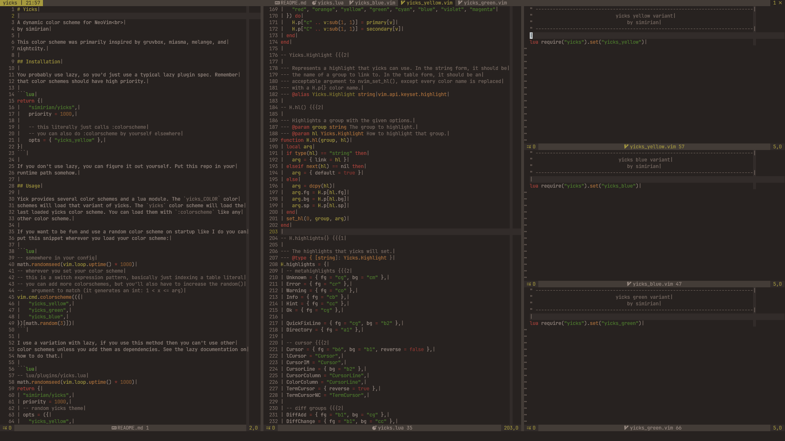
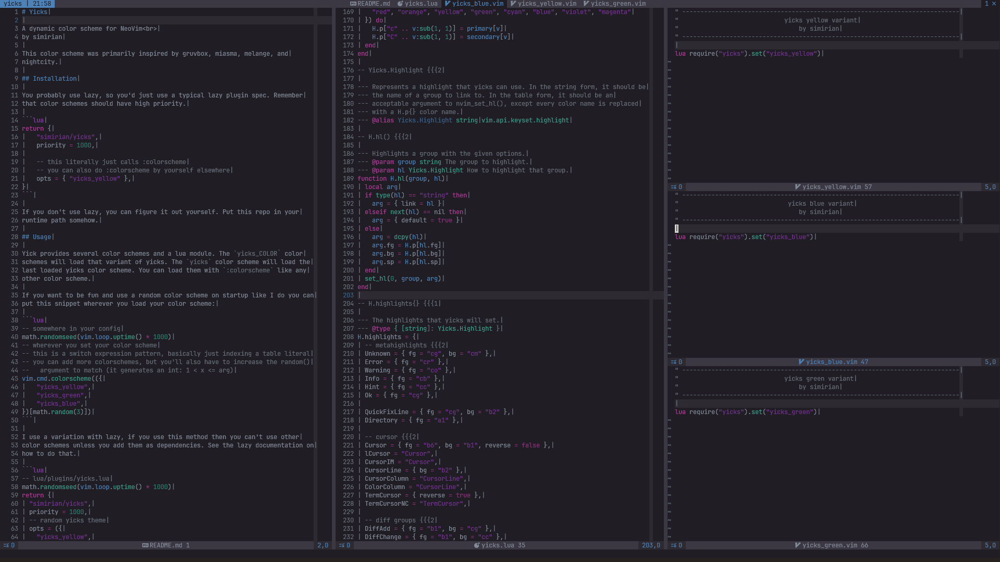
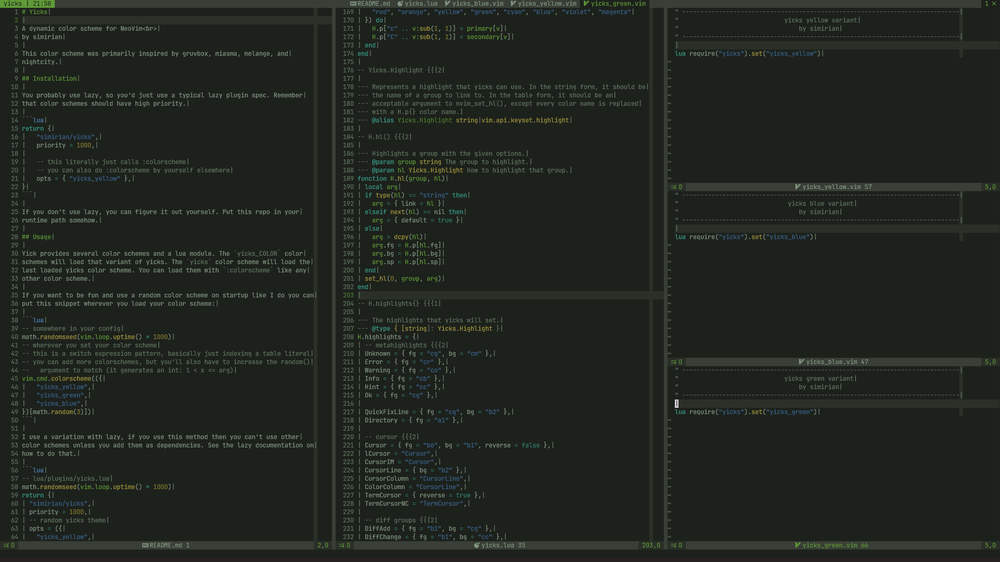

# Yicks

A dynamic color scheme for NeoVim<br>
by simirian

This color scheme was primarily inspired by gruvbox, miasma, melange, and
nightcity.

## Preview





## Installation

You probably use lazy, so you'd just use a typical lazy plugin spec. Remember
that color schemes should have high priority.

```lua
return {
    "simirian/yicks",
    priority = 1000,

    -- this literally just calls :colorscheme
    -- you can also do :colorscheme by yourself elsewhere
    opts = { "yicks_yellow" },
}
```

If you don't use lazy, you can figure it out yourself. Put this repo in your
runtime path somehow.

## Usage

Yicks provides several color schemes and a lua module. The `yicks_COLOR` color
schemes will load that variant of yicks. The `yicks` color scheme will load the
last loaded yicks color scheme. You can load them with `:colorscheme` like any
other color scheme.

If you want to be fun and use a random color scheme on startup like I do you can
put this snippet wherever you load your color scheme:

```lua
-- somewhere in your config
math.randomseed(vim.loop.uptime() * 1000)
-- wherever you set your color scheme
-- this is a switch expression pattern, basically just indexing a table literal
-- you can add more colorschemes, but you'll also have to increase the random()
--   argument to match (it generates an int: 1 < x <= arg)
vim.cmd.colorscheme(({
    "yicks_yellow",
    "yicks_green",
    "yicks_blue",
})[math.random(3)])
```

I use a variation with lazy, if you use this method then you can't use other
color schemes unless you add them as dependencies. See the lazy documentation on
how to do that.

```lua
-- lua/plugins/yicks.lua
math.randomseed(vim.loop.uptime() * 1000)
return {
  "simirian/yicks",
  priority = 1000,
  -- random yicks theme
  opts = ({
    "yicks_yellow",
    "yicks_green",
    "yicks_blue",
  })[math.random(3)],
}
```

If you want to set your color scheme through a lua function you can use the
`yicks.setup()` function. This function should only be called from outside of a
color scheme file. It takes some complicated argumets so here's an explanation
of each case:

1. `string`: Enables the yicks scheme defined on the yicks module with that
   name. If no scheme with that name is found, then nothing happens. If the name
   is `"yicks"` then the previous variant will be used, or the yellow variant if
   it is the first time yicks is being set.
2. `table`: Checks the first value in the table (`opts[1]`). If this is a table,
   it is assumed to be a `Yicks.Schme` and will be used as (3). If it is a
   string, it is used as (1). If the table is empty it will be as if `"yicks"`
   was passed.
3. `Yicks.Scheme`: NOT RECOMMENDED. This loads a scheme directly from a table.
   It would be better if you add the table to the module and use that.

Yicks also has a function `yicks.set()`, but this should ONLY be called from a
colorscheme file in `colors/`. This is to ensure that the `ColorScheme` event
triggers properly. This is also why color schemes should not call
`yicks.setup()`.

### Configuration

The yicks module has color schemes defined on it. If you run `:lua
=require("yicks")`, you will see the whole yicks module.

- `colors` is the set of hues that all yicks themes pick from.
- `yicks_COLOR` are each of the yicks color schemes.
    - `accents` is the name of the accent colors according to `colors`, in order
      of precedence.
    - `dark` is the base colors in dark mode.
    - `light` is the base colors for light mode.

You can define your own variants or modify the existing ones by modifying the
data on the yicks module, following the rules outlines above. The bases all have
relatively intuitive purposes:

1. background
2. in-window decorations, float backgrounds
3. selection, window separators, in-float decorations
4. less important text (comments, 'listchars', etc.)
5. normal text
6. more important text (matching paren, cursorword, etc.)

It is recommended that you use `images/colors.png` to help pick colors. The
bottom 6 rows are arranged in dark/light pairs in order next to their primary
color. They are chosen specifically to work well with the yicks hues. In an HSL
color space you will want to change the H (hue) value of the color to change the
hue (that's like the rainbow color) and optionally the S (saturation) if you
want it to be more or less vibrant. Messing around with L (lightness) can make a
scheme look funky.
